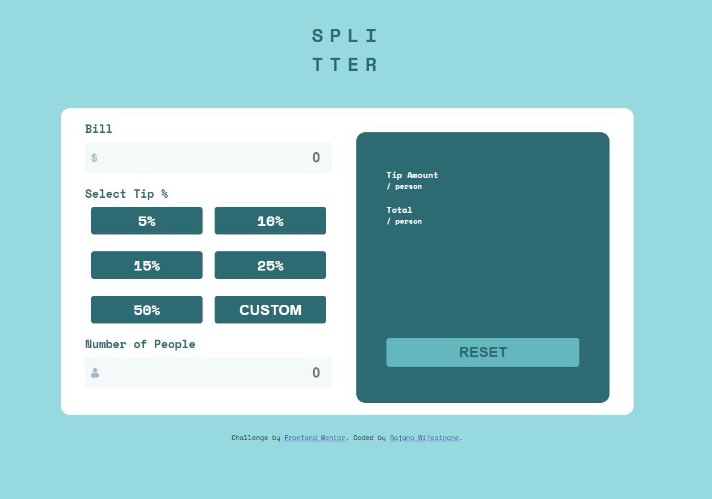
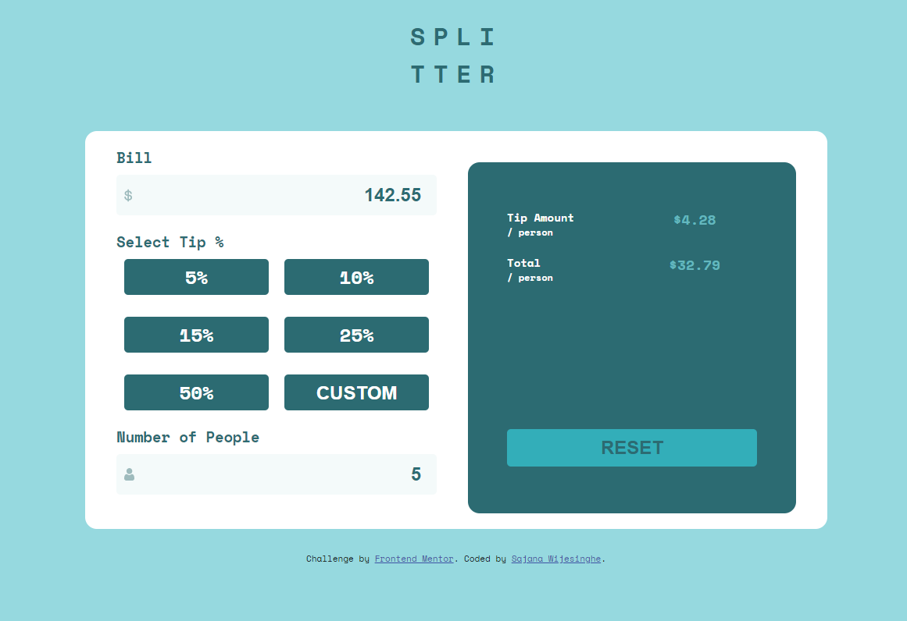
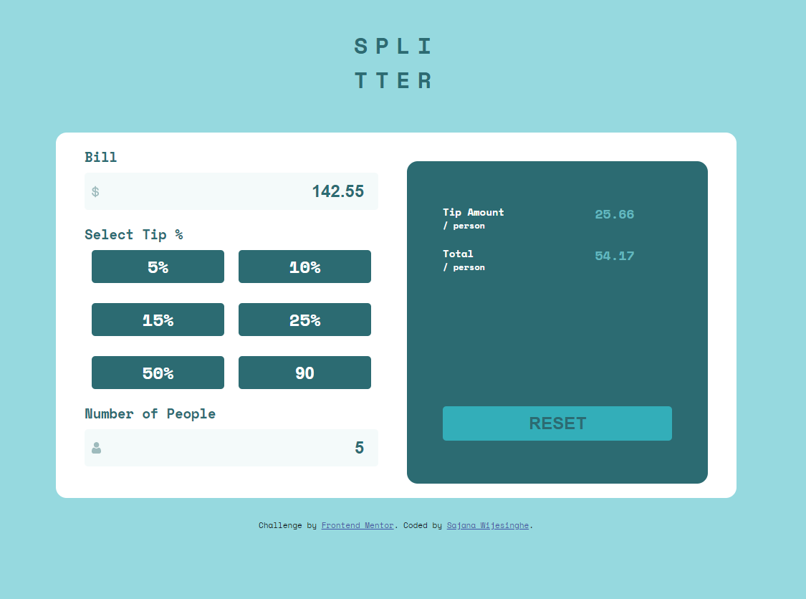
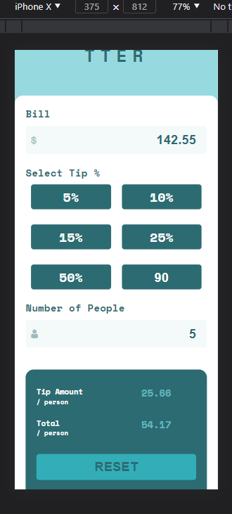
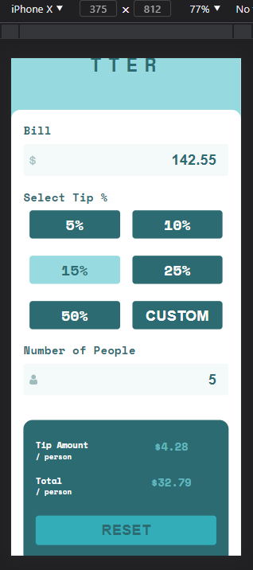

# Frontend Mentor - Tip calculator app solution

This is a solution to the [Tip calculator app challenge on Frontend Mentor](https://www.frontendmentor.io/challenges/tip-calculator-app-ugJNGbJUX). Frontend Mentor challenges help you improve your coding skills by building realistic projects.

## Table of contents

- [Overview](#overview)
  - [The challenge](#the-challenge)
  - [Screenshot](#screenshot)
  - [Links](#links)
- [My process](#my-process)
  - [Built with](#built-with)
  - [Continued development](#continued-development)
- [Author](#author)
- [Acknowledgments](#acknowledgments)

## Overview

### The challenge

Users should be able to:

- View the optimal layout for the app depending on their device's screen size
- See hover states for all interactive elements on the page
- Calculate the correct tip and total cost of the bill per person

### Screenshot

#### DeskTop View

#### Mobile View

### Links

- Solution URL: [https://github.com/StormKing969/Frontend-Mentor---Tip-Calculator](https://github.com/StormKing969/Frontend-Mentor---Tip-Calculator)
- Live Site URL: [https://stormking969.github.io/Frontend-Mentor---Tip-Calculator/](https://stormking969.github.io/Frontend-Mentor---Tip-Calculator/)

## My process

- First I started by placing my HTML content within the tags that I thought was appropriate
- Then I build the CSS design for both my mobile and desktop views (Chose a mobile first approach)
- Afterward, I did the functionality of the project.

### Built with

- Semantic HTML5 markup
- CSS custom properties
- Flexbox
- Mobile-first workflow

### Continued development

While the project may be done, I still feel that I could have done better and improve the code. In the future I intend to redo this project and optimize my code.

## Author

- Website - [Sajana Wijesinghe](https://sajana-wijesinghe.com/)
- Frontend Mentor - [@StormKing969](https://www.frontendmentor.io/profile/StormKing969)

## Acknowledgments

[Daniel Werminghausen](http://danielwerminghausen.com/)